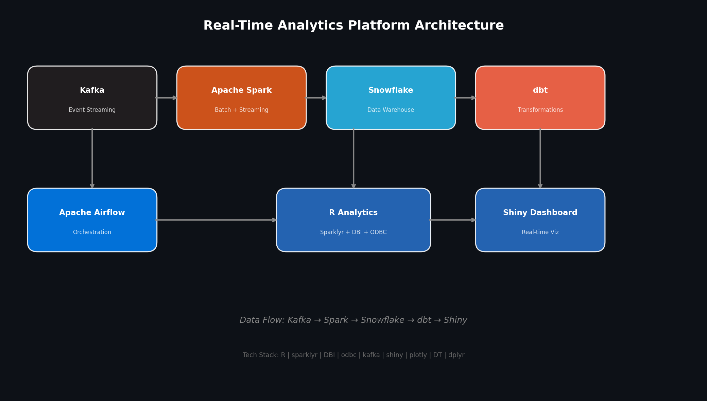

# Real-Time Analytics Platform

A production-ready, end-to-end real-time analytics platform built primarily in **R**, orchestrating **Apache Airflow**, **dbt**, **Apache Spark**, **Apache Kafka**, and **Snowflake**.



## Architecture Overview

```
┌─────────────┐     ┌─────────────┐     ┌─────────────┐     ┌─────────────┐
│   Kafka     │────▶│    Spark    │────▶│  Snowflake  │────▶│    dbt      │
│  (Events)   │     │ (Streaming) │     │  (Raw Data) │     │(Transform)  │
└─────────────┘     └─────────────┘     └─────────────┘     └─────────────┘
       │                                                    │
       │              ┌─────────────┐                       │
       └─────────────▶│    Spark    │───────────────────────┘
                      │   (Batch)   │
                      └─────────────┘
                             │
                             ▼
                      ┌─────────────┐     ┌─────────────┐
                      │   Airflow   │────▶│    R/Shiny  │
                      │(Orchestrate)│     │ (Dashboard) │
                      └─────────────┘     └─────────────┘
```

## Tech Stack

| Layer | Technology | Purpose |
|-------|-----------|---------|
| **Orchestration** | Apache Airflow | DAG-based pipeline scheduling |
| **Transformation** | dbt | SQL-based analytics engineering |
| **Data Warehouse** | Snowflake | Cloud-native data storage |
| **Stream Processing** | Apache Spark + Sparklyr | Real-time & batch processing |
| **Messaging** | Apache Kafka | Event streaming backbone |
| **Visualization** | R Shiny + Plotly | Interactive dashboards |
| **Reporting** | R Markdown | Automated daily reports |
| **Infrastructure** | Docker Compose | Local development & deployment |

## Quick Start

### Prerequisites

- Docker & Docker Compose
- Make
- R 4.3+ (for local development)
- Snowflake account

### 1. Clone & Configure

```bash
git clone <repo-url>
cd realtime-analytics-platform
make setup
```

Edit `.env` with your Snowflake credentials:

```bash
SNOWFLAKE_ACCOUNT=xy12345.us-east-1
SNOWFLAKE_USER=analytics_user
SNOWFLAKE_PASSWORD=***
```

### 2. Start Infrastructure

```bash
make up
```

Services available at:
- **Airflow UI**: http://localhost:8080 (admin/admin)
- **Kafka UI**: http://localhost:8081
- **Spark Master UI**: http://localhost:8082
- **Shiny Dashboard**: http://localhost:3838

### 3. Initialize Kafka Topics

```bash
make kafka-topics
```

### 4. Initialize Snowflake

Run `snowflake/setup.sql` in your Snowflake worksheet or via SnowSQL.

### 5. Trigger Pipeline

In the Airflow UI, enable and trigger the `realtime_analytics_pipeline` DAG.

## Project Structure

```
realtime-analytics-platform/
├── docker-compose.yml          # Multi-service orchestration
├── Makefile                    # Common commands
├── README.md
├── .env.example                # Environment template
│
├── airflow/
│   ├── dags/
│   │   ├── etl_pipeline.py     # Main orchestration DAG
│   │   └── dbt_run.py          # dbt execution DAG
│   ├── Dockerfile
│   └── requirements.txt
│
├── dbt/
│   ├── dbt_project.yml         # dbt configuration
│   ├── profiles.yml            # Connection profiles
│   └── models/
│       ├── staging/            # Staging models
│       ├── marts/              # Business logic models
│       └── sources.yml         # Source definitions
│
├── kafka/
│   ├── producer.R              # R-based event producer
│   ├── consumer.R              # R-based event consumer
│   └── topics.sh               # Topic creation script
│
├── spark/
│   ├── batch_processing.R      # Batch ETL with sparklyr
│   └── streaming_processing.R  # Streaming with sparklyr
│
├── snowflake/
│   ├── setup.sql               # Schema & table creation
│   └── connection.R            # R Snowflake connector
│
├── r_analytics/
│   ├── Dockerfile
│   ├── app.R                   # Shiny dashboard
│   ├── reports/
│   │   └── daily_report.Rmd    # Automated R Markdown report
│   └── utils/
│       ├── snowflake_connector.R
│       ├── kafka_connector.R
│       └── spark_connector.R
│
└── tests/
    └── test_pipeline.R         # R-based test suite
```

## Pipeline DAGs

### 1. `etl_pipeline` (Main DAG)

```
[produce_events] → [spark_streaming] → [spark_batch] → [dbt_run] → [generate_report]
     │                    │                  │              │              │
     └────────────────────┴──────────────────┴──────────────┴──────────────┘
                                    ↓
                         [notify_on_success/failure]
```

**Schedule**: Every hour
**Retries**: 3 with exponential backoff

### 2. `dbt_run` (Transformation DAG)

Runs dbt models with data quality tests.

## Data Flow

1. **Ingestion**: R Kafka producer simulates e-commerce events (clicks, purchases, views)
2. **Streaming**: Spark Structured Streaming (via `sparklyr`) consumes Kafka topics, performs windowed aggregations, and writes to Snowflake
3. **Batch**: Hourly Spark batch jobs compute deep analytics and update feature stores
4. **Transform**: dbt models clean, normalize, and build dimensional models in Snowflake
5. **Serve**: R Shiny dashboard queries Snowflake for real-time KPIs
6. **Report**: R Markdown generates executive summaries daily

## Development

### Running R Scripts Locally

```bash
# Install dependencies
Rscript -e "install.packages(c('sparklyr', 'DBI', 'odbc', 'kafka', 'shiny', 'plotly', 'dplyr', 'dbplyr'))"

# Configure sparklyr
Rscript -e "sparklyr::spark_install(version='3.5.0')"

# Test Snowflake connection
Rscript snowflake/connection.R

# Test Kafka producer
Rscript kafka/producer.R
```

### Running Tests

```bash
make test
```

### Linting R Code

```bash
make lint-r
```

## Production Deployment

### Snowflake

- Use key-pair authentication instead of passwords
- Configure resource monitors and auto-suspend
- Enable Time Travel and Fail-safe for critical tables

### Airflow

- Deploy on Kubernetes with Helm chart
- Use CeleryExecutor with Redis/RabbitMQ
- Store secrets in AWS Secrets Manager or HashiCorp Vault

### Spark

- Deploy on EMR/Datapranix for auto-scaling
- Enable Dynamic Allocation
- Use S3/ADLS for checkpointing

### Kafka

- Deploy on MSK/Confluent Cloud for managed service
- Enable SSL/SASL authentication
- Configure retention policies and compaction

## Monitoring & Alerting

| Component | Tool | Metrics |
|-----------|------|---------|
| Airflow | StatsD + Prometheus | DAG run duration, task failures |
| Spark | Spark UI + Prometheus | Job duration, shuffle read/write |
| Kafka | Kafka UI + JMX | Consumer lag, throughput |
| Snowflake | ACCOUNT_USAGE views | Query history, credit usage |
| Shiny | Prometheus + Grafana | Active sessions, response time |

## License

MIT License - see LICENSE file for details.

## Contributing

1. Fork the repository
2. Create a feature branch (`git checkout -b feature/amazing-feature`)
3. Commit changes (`git commit -m 'Add amazing feature'`)
4. Push to branch (`git push origin feature/amazing-feature`)
5. Open a Pull Request

## Support

For issues and questions, please open a GitHub issue or contact the maintainers.
